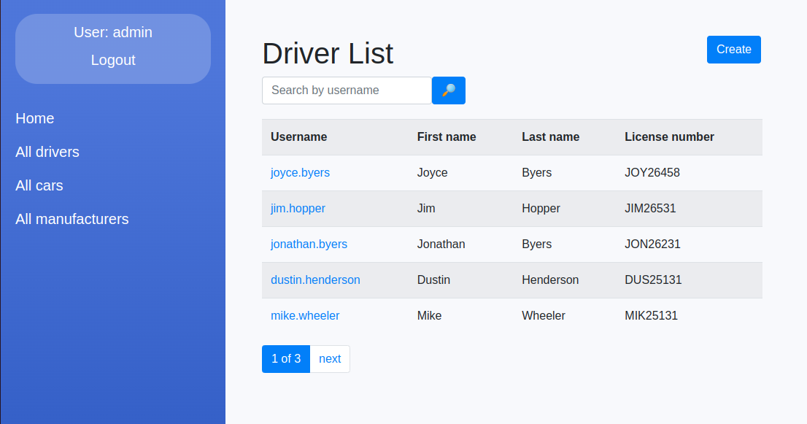

# Taxi Service

Django project for management cars, drivers, and manufacturers of Taxi Service

## Try it on Heroku!

[Taxi Service on Heroku](https://taxi-service441.herokuapp.com/)
Test user:
```shell
Username: user
Password: user12345
```

## If you want to try locally

Download project
```shell
git clone https://github.com/LavrykN/taxi-service.git
```

Create and activate venv environment
```shell
python3 -m venv venv
source venv/bin/activate
```

Install requirements
```shell
pip install -r requirements.txt
```

Migrate migrations
```shell
python3 manage.py migrate
```

If you want you can add template data to the project
```shell
python3 manage.py loaddata test_db_data.json
```

Run server
```shell
python manage.py runserver
```

## Functionality

* Authentication for Driver/User
* Managing cars, drivers, and manufacturers using CRUD operations from the website
* Powerful admin panel for managing

## Demo image




